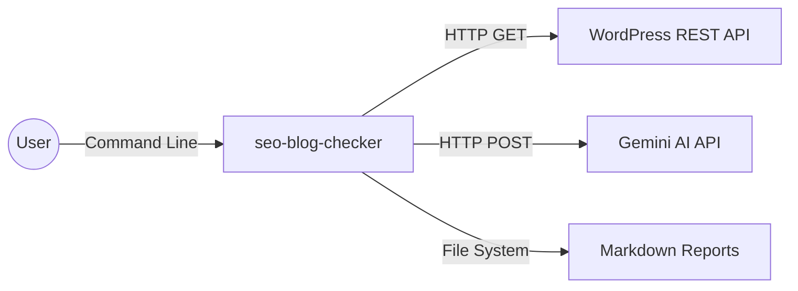
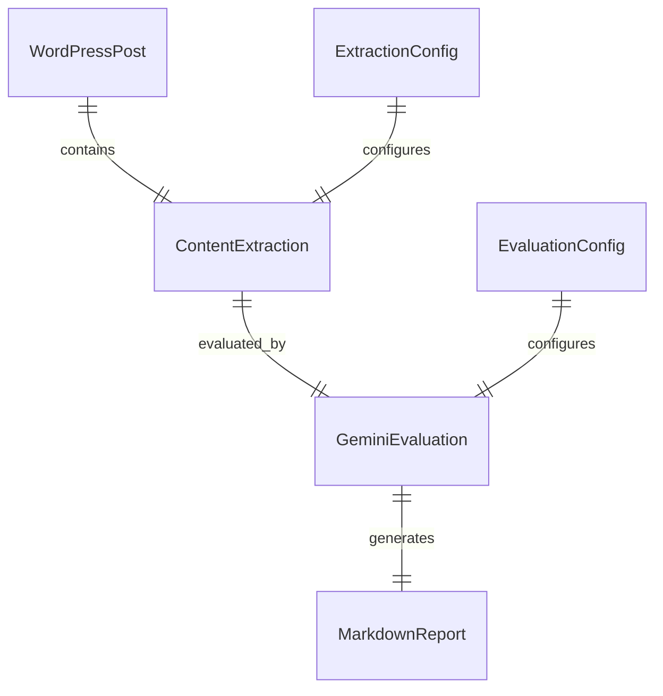

# 02 – Software Architecture

**Project Name:** seo-blog-checker

> "All architecture is design, but not all design is architecture." – Grady Booch

---

## 1. System Context

The system interacts with external WordPress sites and Google's Gemini AI service to perform SEO evaluations.

| Actor / System | Interaction |
|----------------|-------------|
| User | Executes script with slugs/IDs |
| WordPress REST API | Provides blog post content and metadata |
| Gemini AI API | Performs SEO evaluation and analysis |
| File System | Stores configuration files and generated reports |

## 2. Functional Requirements (High-Level)

1. FR-1 – Retrieve WordPress post content via REST API using provided slugs/IDs
2. FR-2 – Extract relevant data based on extraction configuration files
3. FR-3 – Format extracted data for Gemini AI evaluation
4. FR-4 – Send evaluation request to Gemini API with evaluation parameters
5. FR-5 – Parse Gemini API response and extract evaluation results
6. FR-6 – Generate structured Markdown reports from evaluation results
7. FR-7 – Save reports to organized folder structure

## 3. Non-Functional Requirements

| Category | Requirement | Target |
|----------|-------------|--------|
| Performance | Process single post < 30 seconds | 95th percentile |
| Reliability | Handle API failures gracefully | 99% success rate |
| Usability | Generate readable reports for non-technical users | Clear formatting |

## 4. Logical Architecture

| Component | Responsibility | Tech | Data Handled |
|-----------|----------------|------|--------------|
| WordPress Client | API communication | Node.js HTTP | Post content, metadata |
| Content Extractor | Parse WordPress response | Node.js | Structured content data |
| Gemini Client | AI API communication | Node.js HTTP | Evaluation requests/responses |
| Report Generator | Create Markdown reports | Node.js | Formatted evaluation results |
| Config Manager | Load and validate configs | Node.js | JSON/YAML configs |

## 5. Data Model & Storage

| Entity | Notes |
|--------|-------|
| WordPressPost | Raw content from WordPress API |
| ContentExtraction | Structured data for evaluation |
| GeminiEvaluation | AI analysis results |
| MarkdownReport | Final formatted report |

## 6. Interface & API Contracts

| API | Verb | Endpoint | Request / Response |
|-----|------|----------|-------------------|
| WordPress Posts | GET | `/wp-json/wp/v2/posts?slug={slug}` | JSON response |
| Gemini Evaluation | POST | `https://generativelanguage.googleapis.com/v1beta/models/gemini-pro:generateContent` | JSON payload |

## 7. Technology Decisions

| Concern | Choice | Alternatives | Rationale |
|---------|--------|--------------|-----------|
| Language | Node.js | Python, Go | Team expertise, rich ecosystem |
| AI Provider | Gemini | OpenAI, Claude | Cost-effective, good performance |
| Config Format | JSON/YAML | TOML, INI | Human-readable, widely supported |
| Output Format | Markdown | HTML, PDF | Easy to read, version-control friendly |

## 8. Quality Attributes & Tactics

- **Reliability** – Retry logic for API calls, graceful error handling
- **Maintainability** – Modular design, clear separation of concerns
- **Usability** – Clear error messages, helpful documentation
- **Flexibility** – Configuration-driven evaluation criteria

## 9. Deployment & Operations

| Environment | Location | Infra Stack | Notes |
|-------------|----------|-------------|-------|
| Development | Local machine | Node.js runtime | Direct execution |
| Production | Local machine | Node.js runtime | Scheduled execution |

## 10. Observability

| Signal | Tool | Alert Threshold |
|--------|------|----------------|
| Logs | Console output | Error rate > 5% |
| Metrics | Manual tracking | Processing time > 60s |

## 11. Risks & Mitigations

| Risk | Likelihood | Impact | Mitigation |
|------|------------|--------|------------|
| Gemini API changes | Medium | High | Version-specific handling |
| WordPress API limits | Low | Medium | Rate limiting, caching |
| Config file errors | Medium | Low | Validation, clear error messages |

## 12. Open Questions

1. Should we implement caching for WordPress API responses?
2. How should we handle different WordPress site configurations?
3. What's the optimal batch size for processing multiple posts?
